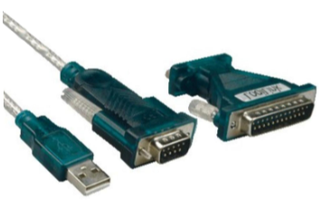
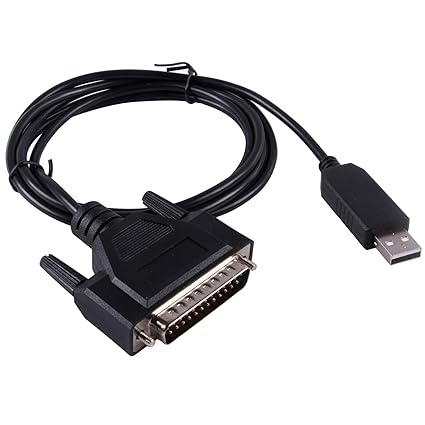

## P2000T ROM Dumper

To archive/dump the P2000T's internal ROM or external cartridge ROMs (in slot 1) to .bin files on your PC, do the following:
* Connect the P2000T to your PC using a serial cross cable or USB-to-serial adapter cable;
* Run [Rom Dumper.bas](<Rom Dumper.bas>) on your P2000T. This will read the cartrige ROM in slot 1 (or the internal Monitor ROM) and send the bytes via the P2000T's serial port at a baudrate of 9600 with no parity, 8 data bits, 1 startbit and 1 stopbit. 
* On the PC you'll need to receive and store the bytes into a .bin dump file;

### Detailed instructions (in Dutch)

Dit is de hardware en software die ik heb gebruikt om P2000T cartridges te archiveren/dumpen naar .bin bestanden onder Windows:

* Een USB naar 25-pin RS-232 seriele adapter. \
  Dit soort adapter kabels zijn relatief goedkoop en hebben meestal een CH340 of FTDI chipset. Voor de CH340 chipset moet in Windows een extra driver geinstalleerd worden; bij een FTDI chipset is dat meestal niet nodig.\
   
 
* M.b.v. de kabel/adapter maak je dan een verbinding tussen de P2000T (seriele poort) en je laptop (USB poort).
 
* Tik dan (eenmalig) het programma [Rom Dumper.bas](<Rom Dumper.bas>) over op je P2000T en bewaar deze m.b.v. `CSAVE "Rom Dumper"` op een cassette voor de volgende keer. Als je dit programma al eerder had ingetikt, dan kun je het uiteraard gewoon inladen. \
En mocht je de utility [pc2p2000t.bas](../pc2p2000t/pc2p2000t.bas) hebben, dan kun je daarmee direct het [Rom Dumper .cas bestand](<../../../../raw/master/cassettes/utilities/Rom Dumper.cas>) vanaf je PC inladen op je P2000T.
 
* Na het intikken/inladen van Rom Dumper.bas run je deze d.m.v. `RUN`. Let op: druk nog niet op een toets!
 
* Op Windows (ik gebruik Windows 10) kun je bij Device Manager zien op welke COM-poort de USB-adapter is gemapt. Dat was in mijn geval COM4. Als het COM-nummer bij jou anders is, vervang in de instructies hieronder `COM4` voor het andere COM poort nummer.

* [eenmalig] Zorg dat je een recente versie van Python hebt geinstalleerd. Python kun hier downloaden: https://www.python.org/downloads/

* [eenmalig] Open een Command Prompt (of Terminal) window en installeer de Python libraries `PySerial` en `Keyboard` (dit hoef je slechts eenmalig te doen):
  ```
  pip install pyserial,keyboard
  ```

* [eenmalig] Download het Python script [rom_to_file.py](rom_to_file.py) naar je computer.

* Navigeer vanuit een Command Prompt window naar de map waarin je rom_to_file.py hebt gedownload. Indien je deze naar de standaard Downloads map hebt gedownload, dan doe je:
  ```
  cd C:\Users\%USERNAME%\Downloads
  ```

* Vervolgens start je in hetzelfde Command Prompt window het Python script [rom_to_file.py](rom_to_file.py), waarbij je de juiste COM poort en het doel bestand opgeeft, bijv:
  ```
  python rom_to_file.py COM4 mijn-cartridge.bin
  ```

* Dan op de P2000T - waar Rom Dumper.bas runt - nu de (P)lugin ROM of (M)onitor ROM toets indrukken, waarmee het archiveren/dumpen gaat beginnen. Alle bytes van de ROM worden via RS-232 naar je PC verstuurd. \
Voor de duidelijkheid: Een plugin ROM is de 16K cartridge in slot 1 en de Monitor ROM is the interne 4K ROM van de P2000T.
 
* Na een tijdje (maximaal 20 seconden voor 16K cartridges) is het archiveren klaar, waarna je de Esc-toets drukt in de Command Prompt, zodat het python programma stopt.

